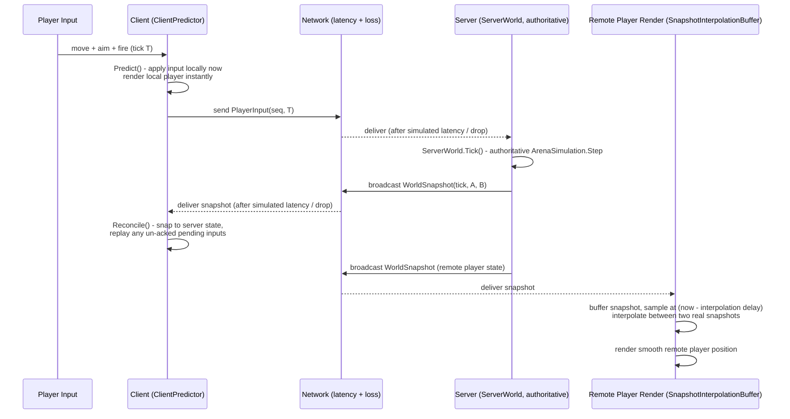

# netcode-arena

**Server-authoritative multiplayer netcode, built from scratch: client-side prediction, server reconciliation, and snapshot interpolation — proven under injected latency and packet loss, not just on a LAN.**


## The real problem

Most solo game-dev portfolios that claim "multiplayer" are naive state sync: send my position, render whatever I last received. That falls apart the moment there's real internet latency — every player feels their own character lag behind their input, and remote players teleport between updates. Studios building competitive or co-op games actually need **rollback-style prediction**: the local player must feel instant, the remote player must look smooth, and the server must stay the single source of truth that both reconcile against. This is one of the hardest, most interview-relevant skills in game networking, and few candidates can show working code for it — most can only describe it.

`netcode-arena` is a 2-player top-down arena (movement + one hitscan weapon) that implements the real thing end to end:

- **Client-side prediction** — the local player moves instantly on input, before any server round trip.
- **Server reconciliation** — when an authoritative snapshot arrives, the client rewinds to it and replays any inputs the server hasn't acknowledged yet, so prediction errors self-correct instead of accumulating.
- **Snapshot interpolation** — the remote player is rendered by interpolating between two buffered server snapshots on a small delay, which absorbs jitter without ever guessing (extrapolating) through a wall.

## How it works

The engine-agnostic simulation core (`NetcodeArena.Core`) is pure C# with zero engine or socket dependencies — the exact same `ArenaSimulation.Step` function runs inside the client's prediction and inside the server's authoritative tick, which is what makes reconciliation trustworthy: given identical `(state, input)`, both sides produce identical output.



The predict → send → reconcile loop runs for the **local** player; the same server snapshots feed the **remote** player's interpolation buffer on a short rendering delay, so both players look responsive without either side trusting the network to be clean.

**Design decisions worth knowing:**
- The client predicts its own movement and weapon cooldown for instant feedback, but never predicts *damage* — health only changes when an authoritative snapshot says so, exactly like how competitive shooters treat hit confirmation as server-only truth.
- If a player's input queue runs dry (loss/latency spike), the server holds that player in place rather than extrapolating them through geometry — the same "don't guess past what you know" philosophy used by the interpolation buffer on the render side.

### Scope note: the Unity layer is intentionally thin/optional

This repo is engine-agnostic by design — `NetcodeArena.Core` has no Unity, no `MonoBehaviour`, no engine types anywhere. A Unity (or any engine) front end would be a thin presentation layer: read local input, call `ClientPredictor`, render `SnapshotInterpolationBuffer` output. That presentation layer is **not built** in this repo (Unity isn't part of the build/test toolchain here) — the deliverable is the hard part: a correct, tested prediction/reconciliation/interpolation core.

**Documented stretch goals (designed, not implemented):**
- Lag-compensated hit detection (rewinding the target to where the shooter saw them, not where they are now).

## Quick start

Requires the .NET 7+ SDK. No Docker, no Unity, and no network access are required to build or test.

```bash
# Restore, build everything (Core + Server + Tests)
dotnet build

# Run the full offline test suite (client-side prediction, reconciliation under injected
# latency/packet loss, snapshot interpolation, weapon system, movement) - no sockets opened.
dotnet test
```

## Project layout

```
src/NetcodeArena.Core/       Pure C# simulation: movement, weapon, prediction, reconciliation,
                              snapshot interpolation, and a deterministic simulated network
                              channel used by the test suite to inject latency/loss.
tests/NetcodeArena.Core.Tests/  xUnit suite - runs fully offline, no Unity/Docker/network.
```

## Testing approach

`ReconciliationUnderNetworkConditionsTests` is the centerpiece: it drives a full client-predicts
/ server-authoritative / client-reconciles loop through `SimulatedNetworkChannel<T>` — a
seeded, deterministic stand-in for a lossy UDP link — with real injected latency and packet
loss, then asserts the client's predicted position converges back to the server's authoritative
position once the network drains. `SnapshotInterpolationBufferTests` cover deterministic
interpolation, jitter-tolerant buffering, and buffer-underrun holding. All tests are
reproducible (seeded RNG, no wall-clock waits, no sockets).

## License

MIT — see [LICENSE](LICENSE).
